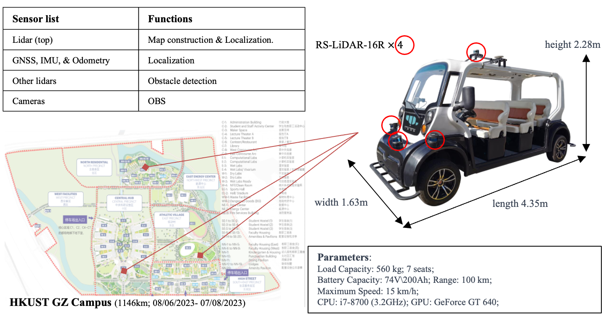

<div align="center">   

# Enhancing Campus Mobility: Achievements and Challenges of the Autonomous Shuttle “Xueshi”

<!-- Yingbing Chen, and Ming Liu -->

</div>

<h3 align="center">
  <a href="https://arxiv.org/pdf/2401.08939.pdf">Arxiv</a> | 
  <a href="https://github.com/ChenYingbing/xueshi_campus_av">Web
  <!-- <a href="https://chenyingbing.github.io/xueshi_campus_av/">Web -->
  </a>
</h3>

<br><br>



This project presents our methods, experiments, and findings related to the autonomous shuttle "Xueshi," which operated on the HKUST-GZ campus and was completed within a two-month timeframe.	

**Abstract**: The rapid evolution of autonomous vehicles (AVs) has significantly influenced global transportation systems. In this context, we present ``Snow Lion'', an autonomous shuttle meticulously designed to revolutionize on-campus transportation, offering a safer and more efficient mobility solution for students, faculty, and visitors. The primary objective of this research is to enhance campus mobility by providing a reliable, efficient, and eco-friendly transportation solution that seamlessly integrates with existing infrastructure and meets the diverse needs of a university setting. To achieve this goal, we delve into the intricacies of the system design, encompassing sensing, perception, localization, planning, and control aspects. We evaluate the autonomous shuttle's performance in real-world scenarios, involving a 1146-kilometer road haul and the transportation of 442 passengers over a two-month period. These experiments demonstrate the effectiveness of our system and offer valuable insights into the intricate process of integrating an autonomous vehicle within campus shuttle operations. Furthermore, a thorough analysis of the lessons derived from this experience furnishes a valuable real-world case study, accompanied by recommendations for future research and development in the field of autonomous driving.


## Table of Contents:

1. [News](#news)
2. [Demos](#demos)
3. [Citation](#citation)


## News <a name="news"></a>

<!-- - **`2022/12/21`** UniAD [paper](https://arxiv.org/abs/2212.10156) is available on arXiv. -->
- **`2024/01/18`** Paper now is available at <a href="https://arxiv.org/pdf/2401.08939.pdf">Arxiv</a>.
- **`2023/09/05`** Initialization.


## Demonstrations <a name="demos"></a>

### 1 Tests
Routing result of a complete navigation task is depicted in the central subfigure, while the remaining subfigures display segments of the navigation tasks.

<p float="left">
  <video width="250" height="150" controls="true" autoplay="true" loop="loop" muted="muted">
    <source src="./sources/demo_run0.mp4" type="video/mp4">
  </video><video width="250" height="150" controls="true" autoplay="true" loop="loop" muted="muted">
    <source src="./sources/demo_run1.mp4" type="video/mp4">
  </video><video width="250" height="150" controls="true" autoplay="true" loop="loop" muted="muted">
    <source src="./sources/demo_run2.mp4" type="video/mp4">
  </video>
</p>
<p float="left">
  <video width="250" height="150" controls="true" autoplay="true" loop="loop" muted="muted">
    <source src="./sources/demo_ca1.mp4" type="video/mp4">
  </video><video width="250" height="150" controls="true" autoplay="true" loop="loop" muted="muted">
    <source src="./sources/demo_routing.mp4" type="video/mp4">
  </video><video width="250" height="150" controls="true" autoplay="true" loop="loop" muted="muted">
    <source src="./sources/demo_ca2.mp4" type="video/mp4">
  </video>
</p>
<p float="left">
  <video width="250" height="150" controls="true" autoplay="true" loop="loop" muted="muted">
    <source src="./sources/demo_run3.mp4" type="video/mp4">
  </video><video width="250" height="150" controls="true" autoplay="true" loop="loop" muted="muted">
    <source src="./sources/demo_run4.mp4" type="video/mp4">
  </video><video width="250" height="150" controls="true" autoplay="true" loop="loop" muted="muted">
    <source src="./sources/demo_run5.mp4" type="video/mp4">
  </video>
</p>

<!-- <div style="display: flex;">
  <div style="flex: 1;">

  <video width="400" height="200" controls="true" autoplay="true" loop="loop" muted="muted">
    <source src="./sources/demo_run0.mp4" type="video/mp4">
  </video>
  </div>

  <div style="flex: 1;">
  <video width="400" height="200" controls="true" autoplay="true" loop="loop" muted="muted">
    <source src="./sources/demo_run1.mp4" type="video/mp4">
  </video>
  </div>

  <div style="flex: 1;">
  <video width="400" height="200" controls="true" autoplay="true" loop="loop" muted="muted">
    <source src="./sources/demo_run2.mp4" type="video/mp4">
  </video>
  </div>

</div>
<div style="display: flex;">
  <div style="flex: 1;">

  <video width="400" height="200" controls="true" autoplay="true" loop="loop" muted="muted">
    <source src="./sources/demo_ca1.mp4" type="video/mp4">
  </video>
  </div>

  <div style="flex: 1;">
  <video width="400" height="200" controls="true" autoplay="true" loop="loop" muted="muted">
    <source src="./sources/demo_routing.mp4" type="video/mp4">
  </video>
  </div>

  <div style="flex: 1;">
  <video width="400" height="200" controls="true" autoplay="true" loop="loop" muted="muted">
    <source src="./sources/demo_ca2.mp4" type="video/mp4">
  </video>
  </div>

</div>
<div style="display: flex;">
  <div style="flex: 1;">

  <video width="400" height="200" controls="true" autoplay="true" loop="loop" muted="muted">
    <source src="./sources/demo_run3.mp4" type="video/mp4">
  </video>
  </div>

  <div style="flex: 1;">
  <video width="400" height="200" controls="true" autoplay="true" loop="loop" muted="muted">
    <source src="./sources/demo_run4.mp4" type="video/mp4">
  </video>
  </div>

  <div style="flex: 1;">
  <video width="400" height="200" controls="true" autoplay="true" loop="loop" muted="muted">
    <source src="./sources/demo_run5.mp4" type="video/mp4">
  </video>
  </div>

</div> -->


### 2 Operational Records from OBS

The videos were captured using OBS, depicting the operational processes of the autonomous shuttle. Individuals wearing blue attire in the videos represent security personnel responsible for emergency prevention.	

<p float="left">
  <video width="300" height="180" controls="true" autoplay="true" loop="loop" muted="muted">
    <source src="./sources/demo_run3.mp4" type="video/mp4">
  </video><video width="300" height="180" controls="true" autoplay="true" loop="loop" muted="muted">
    <source src="./sources/demo_run4.mp4" type="video/mp4">
  </video>
</p>
<p float="left">
  <video width="250" height="150" controls="true" autoplay="true" loop="loop" muted="muted">
    <source src="./sources/opera3.mp4" type="video/mp4">
  </video><video width="250" height="150" controls="true" autoplay="true" loop="loop" muted="muted">
    <source src="./sources/opera4.mp4" type="video/mp4">
  </video><video width="250" height="150" controls="true" autoplay="true" loop="loop" muted="muted">
    <source src="./sources/opera5.mp4" type="video/mp4">
  </video>
</p>

<!-- <div style="display: flex;">
  <div style="flex: 1;">

  <video width="400" height="200" controls="true" autoplay="true" loop="loop" muted="muted">
    <source src="./sources/opera1.mp4" type="video/mp4">
  </video>
  </div>

  <div style="flex: 1;">
  <video width="400" height="200" controls="true" autoplay="true" loop="loop" muted="muted">
    <source src="./sources/opera2.mp4" type="video/mp4">
  </video>
  </div>

</div>
<div style="display: flex;">
  <div style="flex: 1;">
  <video width="400" height="200" controls="true" autoplay="true" loop="loop" muted="muted">
    <source src="./sources/opera3.mp4" type="video/mp4">
  </video>
  </div>

  <div style="flex: 1;">
  <video width="400" height="200" controls="true" autoplay="true" loop="loop" muted="muted">
    <source src="./sources/opera4.mp4" type="video/mp4">
  </video>
  </div>

  <div style="flex: 1;">
  <video width="400" height="200" controls="true" autoplay="true" loop="loop" muted="muted">
    <source src="./sources/opera5.mp4" type="video/mp4">
  </video>
  </div>
</div> -->


## Citation <a name="citation"></a>

Please consider citing our paper if the project helps your research with the following BibTex: 

```bibtex
@article{chen2024ecm,
  title={Enhancing Campus Mobility: Achievements and Challenges of Autonomous Shuttle "Snow Lion''},
  author={Yingbing Chen et al.},
  journal={arXiv preprint arXiv:2401.08939},
  year={2024}
}
```

<br/><br/>
<p align="right">
   &nbsp;&nbsp;&nbsp;&nbsp;&nbsp;  &nbsp;&nbsp;&nbsp;&nbsp;  
</p>

